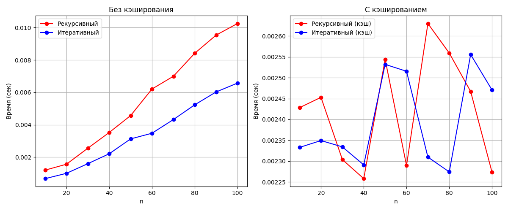

# Отчёт ЛР-5
### ИВТ-1.1, Киселев Георгий

### Цель работы

Реализовать рекурсивный и итеративный способы вычисления факториала с возможностью мемоизации, измерить время выполнения функций, построить графики зависимости, и сравнить полученные результаты.

---

### Текст задачи

Сравнить время работы двух реализаций функции вычисления факториала: рекурсивной и нерекурсивной (через цикл). Изучить материал про мемоизацию и реализовать сравнение мемоизированных и немемоизированных вариантов функций. Проанализировать результаты и сделать выводы, построить графики.

### Описание алгоритма

- **Функция** `factorial_recursive(n)` вычисляет факториал рекурсивным методом
- **Функция** `factorial_iterative(n)` вычисляет факториал итеративным методом  
- **Декоратор** `cache` реализует мемоизацию - кэширование результатов функций
- **Функции с суффиксом** `_cached` используют мемоизацию для ускорения повторных вычислений
- Для сравнения производительности используется модуль `timeit`
- Для визуализации результатов используется библиотека `matplotlib`

---

### Пример кода

#### Декоратор для мемоизации
```python
from typing import Callable

def cache(func: Callable):
    cache = {}
    def wrapper(*args, **kwargs):
        if args in cache:
            return cache[args]
        result = func(*args, **kwargs)
        cache[args] = result
        return result
    return wrapper
```

#### Итеративная реализация
```python
from cache import cache

def factorial_iterative(n):
    if n == 0:
        return 1
    
    result = 1
    for i in range(1, n + 1):
        result *= i
    return result

@cache
def factorial_iterative_cached(n):
    return factorial_iterative(n)
```

#### Рекурсивная реализация
```python
from cache import cache

def factorial_recursive(n):
    if n == 0:
        return 1
    return n * factorial_recursive(n - 1)

@cache
def factorial_recursive_cached(n):
    if n == 0:
        return 1
    return n * factorial_recursive_cached(n - 1)
```

#### Бенчмаркинг
```python
import timeit
import matplotlib.pyplot as plt
from factorial_iterative import factorial_iterative, factorial_iterative_cached
from factorial_recursive import factorial_recursive, factorial_recursive_cached

def benchmark(func, data, number=10000, repeat=5):
    total = 0
    for n in data:
        times = timeit.repeat(lambda: func(n), number=number, repeat=repeat)
        total += min(times)
    return total / len(data)

def main():
    test_data = list(range(10, 101, 10))

    res_recursive = []
    res_iterative = []
    res_recursive_cached = []
    res_iterative_cached = []

    print("Запуск бенчмарков...")
    
    for n in test_data:
        time_recursive = benchmark(factorial_recursive, [n], number=1000)
        time_iterative = benchmark(factorial_iterative, [n], number=1000)
        time_recursive_cached = benchmark(factorial_recursive_cached, [n], number=10000)
        time_iterative_cached = benchmark(factorial_iterative_cached, [n], number=10000)
        
        res_recursive.append(time_recursive)
        res_iterative.append(time_iterative)
        res_recursive_cached.append(time_recursive_cached)
        res_iterative_cached.append(time_iterative_cached)
        
        print(f"n={n}: рекурсив={time_recursive:.6f}s, итератив={time_iterative:.6f}s, рекурсив_кэш={time_recursive_cached:.6f}s, итератив_кэш={time_iterative_cached:.6f}s")

    # Построение графиков
    plt.figure(figsize=(12, 5))
    
    plt.subplot(1, 2, 1)
    plt.plot(test_data, res_recursive, 'ro-', label="Рекурсивный")
    plt.plot(test_data, res_iterative, 'bo-', label="Итеративный")
    plt.xlabel("n")
    plt.ylabel("Время (сек)")
    plt.title("Без кэширования")
    plt.legend()
    plt.grid(True)

    plt.subplot(1, 2, 2)
    plt.plot(test_data, res_recursive_cached, 'ro-', label="Рекурсивный (кэш)")
    plt.plot(test_data, res_iterative_cached, 'bo-', label="Итеративный (кэш)")
    plt.xlabel("n")
    plt.ylabel("Время (сек)")
    plt.title("С кэшированием")
    plt.legend()
    plt.grid(True)

    plt.tight_layout()
    plt.show()
```

---

### Модульные тесты

```python
from factorial_iterative import factorial_iterative, factorial_iterative_cached
from factorial_recursive import factorial_recursive, factorial_recursive_cached

def test_factorials():
    print("Тестирование функций факториала:")
    print("n | Рекурсив | Итератив | Рекурсив(кэш) | Итератив(кэш)")
    print("-" * 60)
    
    for n in [0, 1, 5, 10]:
        rec = factorial_recursive(n)
        it = factorial_iterative(n)
        rec_c = factorial_recursive_cached(n)
        it_c = factorial_iterative_cached(n)
        
        print(f"{n} | {rec:8} | {it:8} | {rec_c:13} | {it_c:12}")

if __name__ == "__main__":
    test_factorials()
```

**Результаты тестирования:**
```
Тестирование функций факториала:
n | Рекурсив | Итератив | Рекурсив(кэш) | Итератив(кэш)
------------------------------------------------------------
0 |        1 |        1 |             1 |            1
1 |        1 |        1 |             1 |            1
5 |      120 |      120 |           120 |          120
10 |  3628800 |  3628800 |       3628800 |      3628800
```

---

### Результаты бенчмаркинга

```
Запуск бенчмарков...
n=10: рекурсив=0.001194s, итератив=0.000668s, рекурсив_кэш=0.002428s, итератив_кэш=0.002333s
n=20: рекурсив=0.001559s, итератив=0.000997s, рекурсив_кэш=0.002453s, итератив_кэш=0.002349s
n=30: рекурсив=0.002549s, итератив=0.001594s, рекурсив_кэш=0.002304s, итератив_кэш=0.002334s
n=40: рекурсив=0.003520s, итератив=0.002205s, рекурсив_кэш=0.002258s, итератив_кэш=0.002291s
n=50: рекурсив=0.004562s, итератив=0.003123s, рекурсив_кэш=0.002544s, итератив_кэш=0.002532s
n=60: рекурсив=0.006209s, итератив=0.003473s, рекурсив_кэш=0.002289s, итератив_кэш=0.002515s
n=70: рекурсив=0.006990s, итератив=0.004316s, рекурсив_кэш=0.002630s, итератив_кэш=0.002310s
n=80: рекурсив=0.008412s, итератив=0.005229s, рекурсив_кэш=0.002559s, итератив_кэш=0.002274s
n=90: рекурсив=0.009533s, итератив=0.006024s, рекурсив_кэш=0.002467s, итератив_кэш=0.002556s
n=100: рекурсив=0.010250s, итератив=0.006579s, рекурсив_кэш=0.002273s, итератив_кэш=0.002471s
```

### Графики результатов



---

### Выводы

1. **Без мемоизации:**
   - Итеративный метод работает стабильнее и быстрее рекурсивного
   - Время выполнения линейно возрастает с ростом n для обоих методов
   - Рекурсивный метод потребляет больше ресурсов из-за глубины рекурсии

2. **С мемоизацией:**
   - Оба метода показывают значительное ускорение при повторных вычислениях
   - Время выполнения становится практически постоянным независимо от n
   - Мемоизация эффективно кэширует результаты, устраняя необходимость повторных вычислений

3. **Общие наблюдения:**
   - Мемоизация особенно эффективна для рекурсивных алгоритмов
   - Для однократных вычислений итеративный метод предпочтительнее
   - Для многократных вычислений одних и тех же значений мемоизация обеспечивает максимальную производительность

4. **Практическая значимость:**
   - Мемоизация является мощным инструментом оптимизации в Python
   - Позволяет значительно ускорить вычисления при работе с повторяющимися данными
   - Особенно полезна для рекурсивных алгоритмов и функций с высокой вычислительной сложностью
